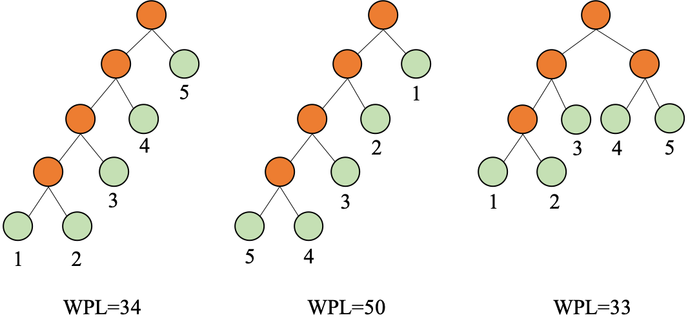
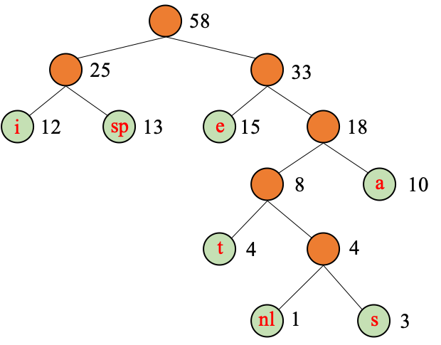

## Huffman Tree and Huffman Coding

### 1 A Question

Suppose there is a text which contains 10, 000 characters, how can we encode this text? One of the solution is ASCII, and the size is 10, 000 Bytes. Can we have a better solution?

One observation is, the frequency of each letter in the text is different, for example, the frequency of e is relatively high. Therefore, it motivates a unequal length coding rather than equal length coding(e.g. ASCII).

### 2 Huffman Tree

***Total Weighted Path Length***(WPL): Suppose the binary tree has $n$ leaf nodes, each leaf node has a weight $w_k$, and the length from the root node to each leaf node is $l_k$, then
$$
WPL = \sum_{k=1}^{n}w_kl_k
$$
The following shows three simple cases:



And such trees that have the minimum *WPL* are **Huffman tree**, or it is also referred as *optimal binary tree*.

### 3 How to create a Huffman Tree

The process begins with the leaf nodes containing the probabilities of the symbol they represent. Then, the process takes the two nodes with smallest probability, and creates a new internal node having these two nodes as children. The weight of the new node is set to the sum of the weight of the children. We then apply the process again, on the new internal node and on the remaining nodes (i.e., we exclude the two leaf nodes), we repeat this process until only one node remains, which is the root of the Huffman tree.

The simplest construction algorithm uses a priority queue where the node with lowest probability is given highest priority:

1. Create a leaf node for each symbol and add it to the priority queue.
2. While there is more than one node in the queue:
   1. Remove the two nodes of highest priority (lowest probability) from the queue
   2. Create a new internal node with these two nodes as children and with probability equal to the sum of the two nodes' probabilities.
   3. Add the new node to the queue.
3. The remaining node is the root node and the tree is complete.

Since efficient priority queue data structures require O(log *n*) time per insertion, and a tree with *n* leaves has 2*n*−1 nodes, this algorithm operates in O(*n* log *n*) time, where *n* is the number of symbols. The following shows a simple C/C++ coded demo. We first define the struct as:

```C++
typedef struct TreeNode *HuffmanTree;
struct TreeNode{
  int weight;
  HuffmanTree left, right;
}
```

Then the code can be written as:

```c
HuffmanTree Huffman(MinHeap H)
{
		int i; HuffmanTree T;
    BuildMinHeap(H);
    for (int i = 1; i < H->Size; i++) {
    		T = malloc(sizeof(struct TreeNode));
    		T->left = DeleteMin(H);
    		T->right = DeleteMin(H);
    		T->weight = T->left->weight + T->right->weight;
    		Insert(H, T);
    }
    T = DeleteMin(H);
    return T;
}
```

In this implementation, the minimum heap is used. And we also can use the simple sort to get the two smallest weights.

### 4 Huffman Coding

First, let us take a look at the following simple example.

> ***Example 1.*** Suppose we have a text of 58 characters consisting of the following seven characters: a, e, i, s, t, space (sp), and newline (nl). The frequencies of these seven characters are: 10,15,12,3,4,13,1. How to encode these seven characters so that the total space is minimal.
>
> (1) ASCII (8 bits), then it is $58*8 = 464$ bits.
>
> (2) We can use a unique encode approach, use 3 bits to encode these seven characters. Then, it is $58*3=174$ bits.
>
> (3) Is there a better way to encode these characters?

And a supplementary knowledge is:

> The binary tree can be used to encoding. 
>
> + Left: 0, Right: 1
> + Characters are binded on the every leaf nodes.

Based on this, if we set the wight of each leaf node as its frequency, then we actually want to obtain a binary tree of which the *WPL* is minimum. And it definitely is Huffman Tree. Thus,  we can construct the Huffman tree as:



Then we have,

| Characters | Huffman Coding |
| :--------: | :------------: |
|     a      |      111       |
|     e      |       10       |
|     i      |       00       |
|     s      |     11011      |
|     t      |      1100      |
|     sp     |       01       |
|     nl     |     11010      |

And the size is:
$$
3 \times 10 + 2 \times 15 + 2 \times 12 + 5 \times 3 + 4 \times 4 + 2 \times 13 + 5 \times 1 = 146
$$
