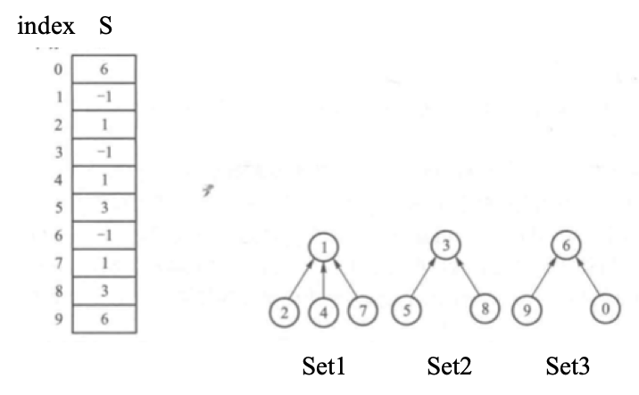
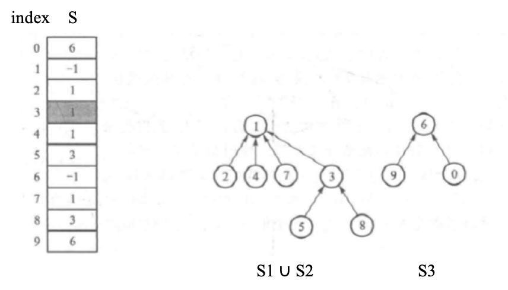
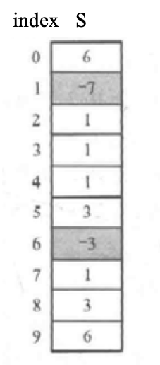

# Set


### Tree Represented Set

> **Example 1.** For $S_1 = \left\{1,2,4,7 \right\}$, $S_2 = \left\{3, 5, 8 \right\}$, $S_3 = \left\{0, 6, 9\right\}$, then they can be represented trees as the following,




### Find

Find the set where the element X belongs to. 

```c++
SetName Find(SetType S, ElementType X){
  	for ( ; S[X] >= 0; X = S[X]);
  	return X;
}
```


### Union

Merge the set of elements X1 with the set of elements X2. Find the root of X1 (Root1) and the root of X2 (Root2), then



```c++
void Union(SetType S, SetName Root1, SetName Root2){
		S[Root2] = Root1;
}
```


### *Union by Rank

We can easily find that, if we employ the above union method, the set tree may degenerate to a linked list. An alternative method is, union by rank. That is to say, merge the small with big one, and perhaps the height will not increase. Here is a tricky, we can use the root node to sotre the tree size. The following shows a C++ demo:

```c++
void Union(SetType S, SetName Root1, SetName Root2) {
		// merge small to big
		if (S[Root2] < S[Root1]) {
				S[Root2] += S[Root1];
				S[Root1] = Root2;
		} else {
				S[Root1] += S[Root2];
				S[Root2] = Root1;
		}
}
```

And the result of above example is:




### *Path Compression

The following paragraph is cited from Prof. Yue Chen's book.

> 如果一棵集合树很不幸地长高了，而我们又不得不反复调用Find去查找它最底部的某个元素，怎么能提高效率？
>
> 有一种“路径压缩”的方法可以在第一次查找的时候把树变矮，使得要查找的元素直接变成根结点的孩子，则下次再查找它的时候就只需要2次比较了，可以大大提高效率。


The following shows a C++ demo,

```c++
SetName Find(SetType S, ElementType X) {
		if (S[X] < 0) {
				return X;
		} else {
				return S[X] = Find(S, S[X]);	// Path Compression
		}
}
```


### Conclusion

```c++
#include <iostream>
using namespace std;

#define MAXN 1000                  
typedef int ElementType;           
typedef int SetName;               
typedef ElementType SetType[MAXN]; 

void Union( SetType S, SetName Root1, SetName Root2 ) { 
    if ( S[Root2] < S[Root1] ) { 
        S[Root2] += S[Root1];    
        S[Root1] = Root2;
    } else {                        
        S[Root1] += S[Root2];    
        S[Root2] = Root1;
    }
}

SetName Find( SetType S, ElementType X ) { 
    if ( S[X] < 0 ) 
        return X;
    else
        return S[X] = Find( S, S[X] ); 
}
```

